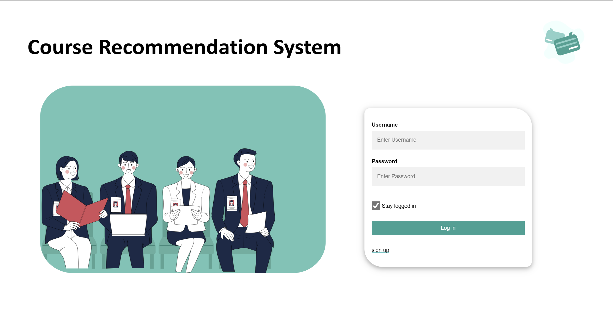
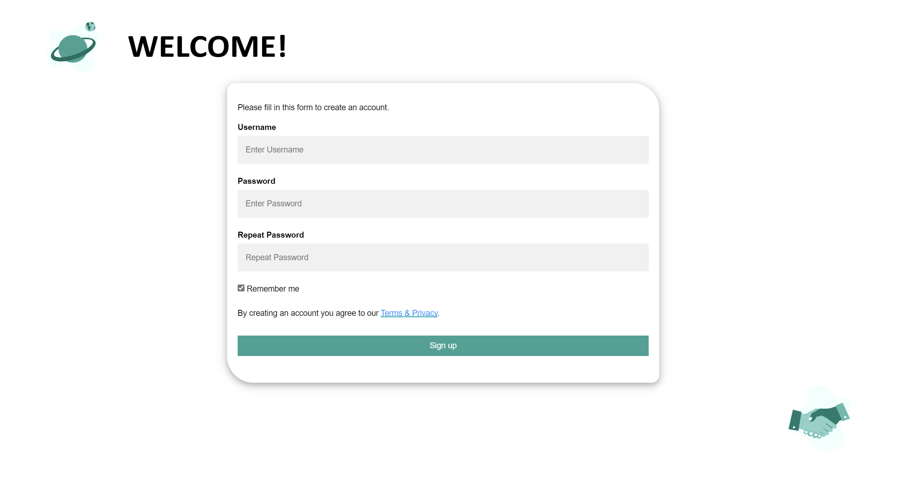
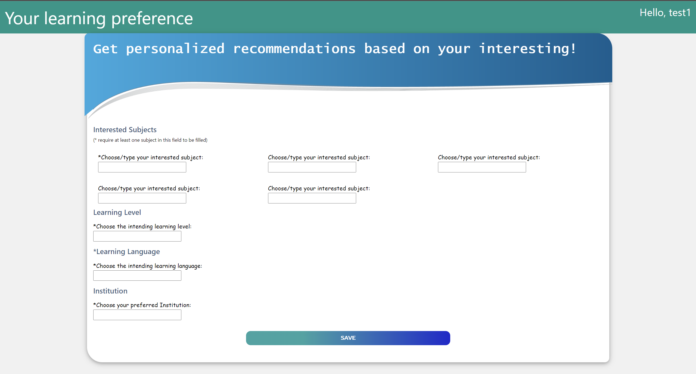
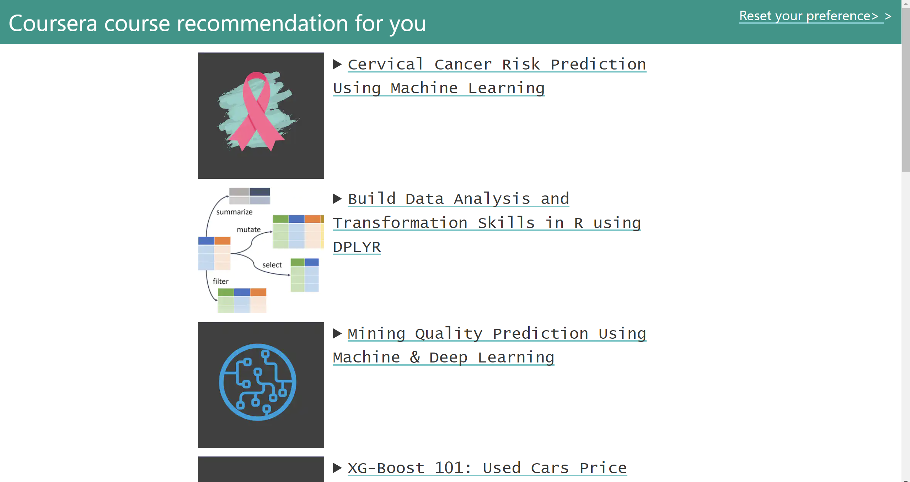
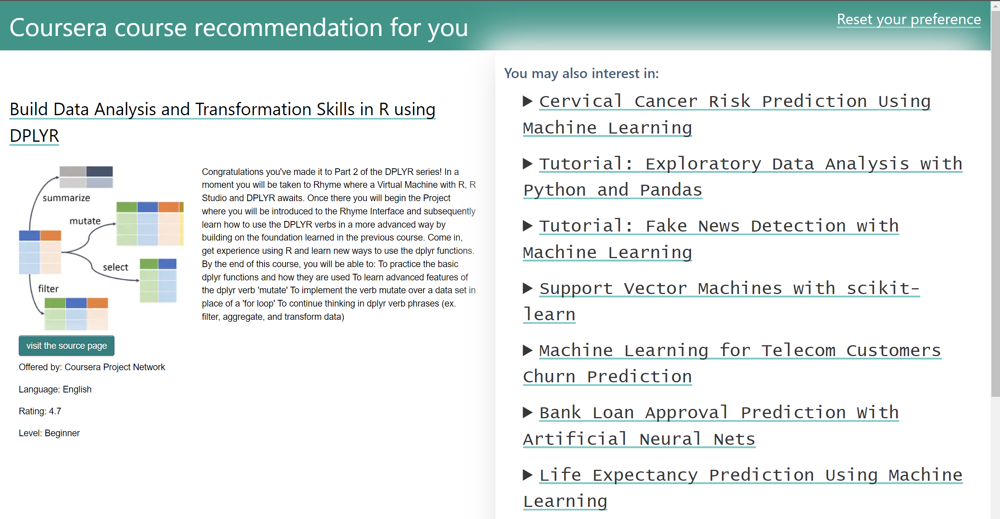

## SECTION 1 : PROJECT TITLE
## Coursera Course Recommender System

---

## SECTION 2 : EXECUTIVE SUMMARY
With the explosion of online information, modern people can easily access different fields of knowledge and develop an interest in areas they may not be familiar with. With the gradual maturation of online education platforms, there is a great deal of enthusiasm for people to try out new knowledge online. However, with the variety of courses available on the internet, it is easy to be overwhelmed and unable to choose the one that best suits their background and interests. To help people have an easy and happy start to their e-learning experience, this project developed a course recommender for the Coursera education platform. The objective is to select the best courses that match the user's interests from the vast educational resources and recommend them to the user, helping the user to make the proper choice more easily and quickly. After the user selects one of the courses, the system will calculate the similarity among the courses and keep making recommenders to our users.

Three kinds of reasoning systems—content-based reasoning, similarity-based reasoning, and knowledge-based reasoning—are used by the product. We carefully observed the courses’ details and extracted a set of features from them to thoroughly describe Coursera’s course. The system also has a user preference setting page for collecting and generalising user preferences into the user profile. Based on the user's profile, the system will recommend the top ten closest match courses against the course descriptions to the user. Besides, the similarity between every two courses is pre-calculated considering all the set of course features and is loaded into the system. Each time the user selects a course of interest, the system will recommend ten similar courses, ranked by their distance. Each element in the set of features disparately contributes to the similarity calculation. Our team assigned different weights to different features based on our research and knowledge, to perform the similarity calculation.

The knowledge base for this project is collected from open source Coursera Course Dataset published on Kaggle, combined with further detailed course information scraped from Coursera's official website. Data preparation and data transformation, such as data cleaning and feature engineering, are applied to the raw data. All processed course features are stored in an SQL database. According to the attribution of similarity-based reasoning, the similarity between every two classes is pre-calculated. The top 10 similar courses’ id are then stored in the SQL database.

With the Coursera Course Recommender System, one can approach a suitable set of courses in a short time, saving a lot of unnecessary time in browsing through numerous web pages and picking a satisfying course. It allows you to focus more on the course's content and learning itself.

---

## SECTION 3 : CREDITS / PROJECT CONTRIBUTION

| Official Full Name  | Student ID (MTech Applicable)  | Work Items (Who Did What) | Email (Optional) |
| :------------ |:---------------:| :-----| :-----|
| Chen Zihao | A0261858R | 1. Data collection 2. Data preprocessing 3. System models and algorithms design 4. Report writing | E0983252@nus.edu.sg |
| Liu Haoran | A0261945X | 1. System architecture design  2. Back-end web service development  3. Database development  4. Report writing| haoran.h.liu@u.nus.edu |
| Ku Maier | A0261822J | 1. Product prototype design  2.front-end User Interface development  3.Report writing and business video making| e0983216@u.nus.edu |
| Shen Jingyu | A0261670H | 1. Market Research  2. front-end User Interface development   3. Report writing and business video making | e0983064@u.nus.edu |

---

## SECTION 4 : VIDEO OF SYSTEM MODELLING & USE CASE DEMO

---

## SECTION 5 : USER GUIDE

`Refer to appendix <Installation & User Guide> in project report at Github Folder: ProjectReport`

### To run this system on your computer

#### Requirements

Enter folder:
> $ cd SystemCode/course-recommendation-main

Install dependencies:
> pip install -r requirements.txt

Run Django web server:
> python manage.py makemigrations

> python manage.py migrate

> python manage.py runserver

> **Go to URL using web browser** http://127.0.0.1:8000/

#### User Guide

1. Installation Guide

   As the development and debugging of this project is based on the Windows operating system, we strongly recommend that you use Windows to run our system. All the following guides are based on Windows.

   + Step1: Download and install Anaconda

     You can skip this step if you have downloaded and installed anaconda.
     Anaconda is an open source distribution of Python and R that simplifies package management systems and deployment. You can download Anaconda from their website and install it by following official instruction.

   + Step2: Create a new conda environment

     As a large number of third party Python packages will be used in this project, you should create a new conda environment to avoid conflicts between packages.

     Type in conda prompt: conda create -n your env name python=3.8

   + Step3: Clone or download our system from Github

     You can use git command to clone our project from Github.
     Type in git prompt: git clone https://github.com/Theno-Chan/CourseraCourseRecommender.git

     Or you can directly download system code from Github.

   + Step4: Install the Required Python Packages

     You need to change directory to the Clone Repository folder or download folder. 

     Type in cmd: cd /to/the/right/folder

     And run this command in cmd: pip install -r requirements.txt

   + Step5: Run web server

     Run this command in cmd: python manage.py runserver

     After running, you can open your web browser and type 127.0.0.1:8000 in the address bar. Then you will be directed to the index page!

2. User Manual

   + Sign up for a new account

     Click on the ”signup” button on the home page and you will be redirected to the registration page. You should enter your username as well as your password in the corresponding fields on the new page and click on the ”Sign up” button. 

     

   + Log in

     You should enter your username as well as your password in the corresponding fields on the home page and click on the ”Log in” button.

     

   + Set up your preference

     You will access this part in two ways: when you first register your account or when you click the ”Reset your preferences” button. You should enter at least 1 subject and up to five subjects. And other fields marked with an asterisk are required. 

     

   + Personalised recommendations

     Once you have finished logging in or completed your preferences, you will be able to access the personalised recommendation results. This page will display the top ten recommendations calculated by the model and you can view basic information about the course on this page. You can also click on the course link to access the course details.

     

   + Courses details and recommendations

     This page will show you details of the course you clicked on, as well as ten similar courses recommended by the system.

     

---
## SECTION 6 : PROJECT REPORT / PAPER

`Refer to project report at Github Folder: ProjectReport`

**Sections for Project Report / Paper:**

+ Executive Summary 
+ Problem Statement & Objectives
  + Market Search 
    + Popularity of online learning
    + Online learning industry market size and trends
    + Existing online courses recommendation systems, features and pricing
    + Areas of improvements
  + Aims and Objectives
    + Aims
    + Objectives
+ Solution
  + Knowledge Modelling and Acquisition
    + Knowledge Acquisition
    + Knowledge Representation
    + Knowledge Implementation (Model)
  + System architecture
  + Recommender Logic
    + User-preference courses recommender
    + Subsequent content-based user-courses recommender
  + System Back-end
    + Web server framework
    + Database
  + System Front-end (User interface)
+ Project Implementation: A Case Study
+ System Performance
  + Recommendation For User
  + Recommendation For Course

- Conclusion
- References
- Appendix
  - Appendix A: Project Proposal
  - Appendix B: Functionalities & Intelligent Reasoning System Mapping
  - Appendix C: User Manual Guide
  - Appendix D: Individual Project report

---
## SECTION 7 : MISCELLANEOUS

`Refer to Github Folder: Miscellaneous`

### Coursera.csv
* Application data that we collected from ‘Kaggle’ website

### Coursera_courses.csv

* Application data that we collected from ‘Kaggle’ website

---

**This [Machine Reasoning (MR)](https://www.iss.nus.edu.sg/executive-education/course/detail/machine-reasoning "Machine Reasoning") course is part of the Analytics and Intelligent Systems and Graduate Certificate in [Intelligent Reasoning Systems (IRS)](https://www.iss.nus.edu.sg/stackable-certificate-programmes/intelligent-systems "Intelligent Reasoning Systems") series offered by [NUS-ISS](https://www.iss.nus.edu.sg "Institute of Systems Science, National University of Singapore").**

**Lecturer: [GU Zhan (Sam)](https://www.iss.nus.edu.sg/about-us/staff/detail/201/GU%20Zhan "GU Zhan (Sam)")**

**zhan.gu@nus.edu.sg**
